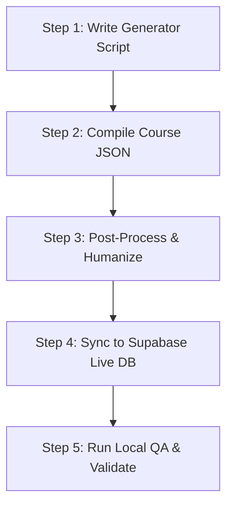

# 🎓 New Course Generation - Master Guide

This master guide provides a comprehensive, step-by-step workflow for creating, compiling, post-processing, and syncing a new course in the Beelesson platform.

---

## 🏗️ Course Data Structure Overview

A course in O-sekha is structured hierarchically. The hierarchy is defined in a JSON file as follows:

```
Course (Course Metadata)
 └── Units (Modules)
      └── Chapters
           └── Learning Points (LPs)
                └── Questions
                     └── Options
```

### 📏 Rules and Standards
1. **Chapter Distribution**: Every module (Unit) must be fully fleshed out with a specific number of chapters based on source material coverage (usually 8 chapters per module to cover topics comprehensively).
2. **Learning Point Distribution**: Each chapter must contain exactly **8 Learning Points (LPs)** and exactly **8 corresponding questions** (1 question per LP).
3. **Standardized Option Limits**:
   - **MCQ, Checkmark, Storytelling, and Matching**: Must have exactly **3 options** (1 correct, 2 incorrect).
   - **Boolean**: Must have exactly **2 options** ("সত্য" and "মিথ্যা").
4. **Randomized Question Types**: Within each chapter, the 8 questions must use a randomized mix of the following types:
   - `mcq` (Standard MCQ)
   - `boolean` (True/False)
   - `checkmark` (Multiple Select)
   - `matching` (Column Matching)
   - `storytelling` (Dialogue-based scenario with Rakib & Lisa)
5. **Clean UI (No Hints/Prefixes)**: Question texts must be clean and direct. Instruction prefixes (e.g. *"[সত্য/মিথ্যা]"* or *"(সবগুলো সিলেক্ট করুন)"*) must be removed from the final user-facing text.

---

## 🛠️ Step-by-Step Generation Workflow



### 1️⃣ Step 1: Write the Generator Script
Create a new script in the `scripts/` directory named `generate_<course_slug>_course.js` (e.g., `generate_password_course.js`).

The script contains:
* **Course Meta Information**: Title, slug, description, category, and ID.
* **Curriculum Definition**: A dense array of Units and Chapters with base facts (`cFact`, `wFact`) and actions (`cAct`, `wAct1`, `wAct2`) for expansion.
* **Expansion Logic**: Dynamically maps base facts to the 5 question types using helper functions and generates UUIDs (`crypto.randomUUID()`) for all entities.

*Example template structure:*
```javascript
const courseMetadata = [
  {
    unitTitle: "মডিউলের নাম",
    chapters: [
      {
        title: "চ্যাপ্টার নাম (সংক্ষিপ্ত)",
        noun: "বিষয়বস্তু",
        cFact: "সঠিক তথ্য",
        wFact: "ভুল তথ্য",
        cAct: "সঠিক কাজ",
        wAct1: "ভুল কাজ ১",
        wAct2: "ভুল কাজ ২"
      }
    ]
  }
];
```

---

### 2️⃣ Step 2: Compile the Course JSON
Run the generator script to compile raw facts into the structured JSON schema:

```bash
node scripts/generate_<course_slug>_course.js
```

This compiles the fact-sheets and saves two files:
1. `database/courses/<course_slug>.json` (Target course database)
2. `scratch/<course_slug>_backup.json` (Scratch backup)

---

### 3️⃣ Step 3: Post-Process & Quality Assurance
Run the standard cleanup scripts to format and sanitize the compiled questions:

#### A. Humanize Questions & Explanations
Adds conversational Bengali phrasing and lighthearted humor to make explanations sound like they were written by a human.
```bash
node scripts/humanize_questions.js
```

#### B. Clean Chapter & LP Prefixes
Removes repetitive text prefixes that refer back to the chapter or learning point name, making questions direct.
```bash
node scripts/clean_question_prefixes.js
```

#### C. Remove Suffix Hints
Cleans parenthetical helper hints (e.g., `(সবগুলো সিলেক্ট করুন)` or `(টিক দিন)`) from question texts for a clean UI.
```bash
node scripts/remove_question_hints.js
```

---

### 4️⃣ Step 4: Sync the Course to the Live Database (Supabase)
Create/Update a database synchronization script in the `scripts/` directory (e.g., `sync_<course_slug>_course.js`).

This script uses the Supabase Admin API to:
1. Authenticate the admin sync worker.
2. Clean existing course units, chapters, questions, and options.
3. Bulk upsert course metadata, units, chapters, learning points, questions, and options to the live Supabase database.

Run the sync script:
```bash
node scripts/sync_<course_slug>_course.js
```

---

### 5️⃣ Step 5: Local QA & Verification
1. Start the local server to test the UI flow:
   ```bash
   npm run dev
   ```
2. Navigate to the course in your web browser. Verify:
   * Chapter titles are short, clear, and readable.
   * Question types appear randomly.
   * "হিন্ট দেখুন" / "হিন্ট লুকান" action button toggles properly.
   * Explanations and option counts are correct.
